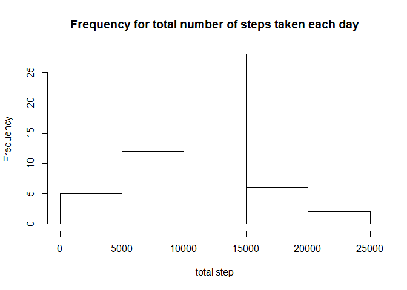
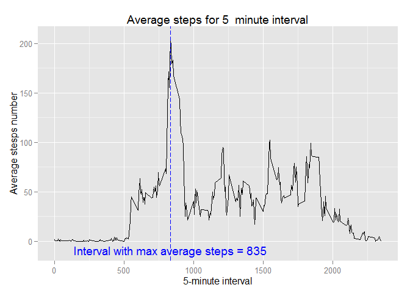
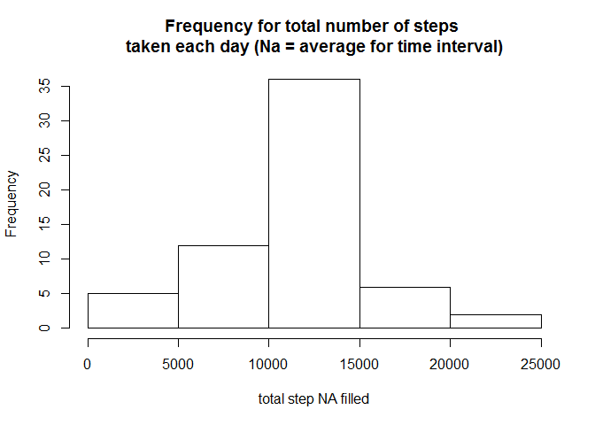
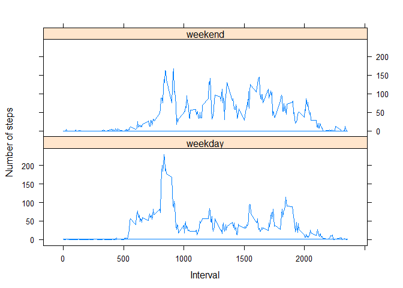

# Test
WDoorsamy  
Monday, January 12, 2015  


## Loading and preprocessing the data

```r
if (!file.exists("./data")) {
    dir.create("./data")
}
fileUrl <- "http://d396qusza40orc.cloudfront.net/repdata%2Fdata%2Factivity.zip"
download.file(fileUrl, destfile = "./data/activity.zip")
unzip("./data/activity.zip", exdir = "./data", overwrite = TRUE)
loader <- read.csv("./data/activity.csv", sep = ",", na.strings = "NA")
loader1 <- loader[complete.cases(loader), ]
```

## What is mean total number of steps taken per day?
Make histogram for total steps for each day:

```r
aggrstep <- aggregate(loader1$steps, list(loader1$date), sum)
names(aggrstep) <- c("date", "totsteps")
hist(aggrstep$totsteps, main = "Frequency for total number of steps taken each day",xlab = "total step")
```

 

The mean and median total number of steps taken per day, respectively, are:

```r
mean(aggrstep$totsteps)
```

```
## [1] 10766.19
```

```r
median(aggrstep$totsteps)
```

```
## [1] 10765
```
##What is the average daily activity pattern?

```r
averages <- aggregate(loader1$steps, list(loader1$interval), mean)
names(averages) <- c("interval", "average")
head(averages)
```

```
##   interval   average
## 1        0 1.7169811
## 2        5 0.3396226
## 3       10 0.1320755
## 4       15 0.1509434
## 5       20 0.0754717
## 6       25 2.0943396
```
Make a time series plot (i.e. type = "l") of the 5-minute interval (x-axis) and the average number of steps taken, averaged across all days (y-axis)

```r
maxaverage <- paste("Interval with max average steps =", subset(averages$interval, averages$average == 
    max(averages$average)))
library("ggplot2")
g <- ggplot(averages, aes(interval, average))
g + geom_line() + labs(x = "5-minute interval") + labs(y = "Average stesps number") + 
    labs(title = "Average steps for 5  minute interval") + geom_vline(xintercept = 835, 
    colour = "blue", linetype = "longdash") + annotate("text", y = -9.2, x = 835, 
    label = maxaverage, colour = "blue")
```

 
Report 5 minute interval with maximum number of steps on average as shown on plot:

```r
subset(averages$interval, averages$average == max(averages$average))
```

```
## [1] 835
```
## Imputing missing values
Note that there are a number of days/intervals where there are missing values (coded as NA). The presence of missing days may introduce bias into some calculations or summaries of the data.

Calculate and report the total number of missing values in the dataset (i.e. the total number of rows with NAs)

```r
nrow(loader) - nrow(loader[complete.cases(loader), ])
```

```
## [1] 2304
```
Devise a strategy for filling in all of the missing values in the dataset. The strategy does not need to be sophisticated. For example, you could use the mean/median for that day, or the mean for that 5-minute interval, etc.

Create a new dataset that is equal to the original dataset but with the missing data filled in.

```r
loaderm <- merge(loader, averages)

loaderm$steps[is.na(loaderm$steps)] <- round(loaderm$average, 0)[is.na(loaderm$steps)]

loadermfilled <- as.data.frame(cbind(steps = loaderm$steps, date = as.character(loaderm$date), 
    interval = loaderm$interval))

loadermfilled$interval <- as.integer(as.character(loadermfilled$interval))

loadermfilled$steps <- as.integer(as.character(loadermfilled$step))

loadermfilledord <- loadermfilled[with(loadermfilled, order(date)), ]

str(loader)
```

```
## 'data.frame':	17568 obs. of  3 variables:
##  $ steps   : int  NA NA NA NA NA NA NA NA NA NA ...
##  $ date    : Factor w/ 61 levels "2012-10-01","2012-10-02",..: 1 1 1 1 1 1 1 1 1 1 ...
##  $ interval: int  0 5 10 15 20 25 30 35 40 45 ...
```

```r
str(loadermfilledord)
```

```
## 'data.frame':	17568 obs. of  3 variables:
##  $ steps   : int  2 0 0 0 0 2 1 1 0 1 ...
##  $ date    : Factor w/ 61 levels "2012-10-01","2012-10-02",..: 1 1 1 1 1 1 1 1 1 1 ...
##  $ interval: int  0 5 10 15 20 25 30 35 40 45 ...
```

```r
head(loader, 7)
```

```
##   steps       date interval
## 1    NA 2012-10-01        0
## 2    NA 2012-10-01        5
## 3    NA 2012-10-01       10
## 4    NA 2012-10-01       15
## 5    NA 2012-10-01       20
## 6    NA 2012-10-01       25
## 7    NA 2012-10-01       30
```

```r
head(loadermfilledord, 7)
```

```
##     steps       date interval
## 1       2 2012-10-01        0
## 63      0 2012-10-01        5
## 128     0 2012-10-01       10
## 205     0 2012-10-01       15
## 264     0 2012-10-01       20
## 327     2 2012-10-01       25
## 376     1 2012-10-01       30
```

Make a histogram of the total number of steps taken each day and Calculate and report the mean and median total number of steps taken per day. Do these values differ from the estimates from the first part of the assignment? What is the impact of imputing missing data on the estimates of the total daily number of steps?


```r
aggrstepfilled <- aggregate(loadermfilledord$steps, list(loadermfilledord$date), 
    sum)
names(aggrstepfilled) <- c("date", "totsteps")

hist(aggrstepfilled$totsteps, main = "Frequency for total number of steps \ntaken each day (Na = average for time interval)",xlab = "total step NA filled")
```

 

```r
mean(aggrstepfilled$totsteps)
```

```
## [1] 10765.64
```

```r
median(aggrstepfilled$totsteps)
```

```
## [1] 10762
```

## Are there differences in activity patterns between weekdays and weekends?
For this part the weekdays() function may be of some help here. Use the dataset with the filled-in missing values for this part.

Create a new factor variable in the dataset with two levels -- "weekday" and "weekend" indicating whether a given date is a weekday or weekend day.

Make a panel plot containing a time series plot (i.e. type = "l") of the 5-minute interval (x-axis) and the average number of steps taken, averaged across all weekday days or weekend days (y-axis). 


```r
loadermfilledord$date <- as.POSIXct(as.character(loadermfilledord$date), format = "%Y-%m-%d")

loadermfilledord$daytype <- "weekday"

loadermfilledord$daytype[weekdays(loadermfilledord$date) %in% c("Saturday", "Sunday")] <- "weekend"

loadermfilledord$daytype <- as.factor(loadermfilledord$daytype)

str(loadermfilledord)
```

```
## 'data.frame':	17568 obs. of  4 variables:
##  $ steps   : int  2 0 0 0 0 2 1 1 0 1 ...
##  $ date    : POSIXct, format: "2012-10-01" "2012-10-01" ...
##  $ interval: int  0 5 10 15 20 25 30 35 40 45 ...
##  $ daytype : Factor w/ 2 levels "weekday","weekend": 1 1 1 1 1 1 1 1 1 1 ...
```

```r
head(loadermfilledord)
```

```
##     steps       date interval daytype
## 1       2 2012-10-01        0 weekday
## 63      0 2012-10-01        5 weekday
## 128     0 2012-10-01       10 weekday
## 205     0 2012-10-01       15 weekday
## 264     0 2012-10-01       20 weekday
## 327     2 2012-10-01       25 weekday
```

```r
averagewd <- aggregate(loadermfilledord$steps[loadermfilledord$daytype == "weekday"], 
    list(loadermfilledord$interval[loadermfilledord$daytype == "weekday"]), mean)
names(averagewd) <- c("interval", "averagedaytype")
merwd <- merge(loadermfilledord[loadermfilledord$daytype == "weekday", ], averagewd)
averagewe <- aggregate(loadermfilledord$steps[loadermfilledord$daytype == "weekend"], 
    list(loadermfilledord$interval[loadermfilledord$daytype == "weekend"]), mean)
names(averagewe) <- c("interval", "averagedaytype")
merwe <- merge(loadermfilledord[loadermfilledord$daytype == "weekend", ], averagewe)
head(merwd)
```

```
##   interval steps       date daytype averagedaytype
## 1        0     2 2012-10-01 weekday       2.288889
## 2        0     2 2012-11-30 weekday       2.288889
## 3        0     0 2012-11-07 weekday       2.288889
## 4        0     0 2012-11-20 weekday       2.288889
## 5        0     0 2012-11-12 weekday       2.288889
## 6        0    10 2012-10-22 weekday       2.288889
```

```r
head(merwe)
```

```
##   interval steps       date daytype averagedaytype
## 1        0     0 2012-10-06 weekend           0.25
## 2        0     0 2012-11-25 weekend           0.25
## 3        0     2 2012-11-04 weekend           0.25
## 4        0     0 2012-11-17 weekend           0.25
## 5        0     2 2012-11-10 weekend           0.25
## 6        0     0 2012-10-21 weekend           0.25
```

```r
averagedaytype <- rbind(merwd, merwe)
averagedaytypeord <- averagedaytype[with(averagedaytype, order(date)), ]
averagedaytypeord$averagedaytype <- round(averagedaytypeord$averagedaytype)
head(averagedaytypeord)
```

```
##     interval steps       date daytype averagedaytype
## 1          0     2 2012-10-01 weekday              2
## 53         5     0 2012-10-01 weekday              0
## 124       10     0 2012-10-01 weekday              0
## 165       15     0 2012-10-01 weekday              0
## 206       20     0 2012-10-01 weekday              0
## 237       25     2 2012-10-01 weekday              2
```

```r
library(lattice)
xyplot(averagedaytypeord$averagedaytype ~ averagedaytypeord$interval | averagedaytypeord$daytype, 
    type = "l", layout = c(1, 2), xlab = "Interval", ylab = "Number of steps")
```

 
